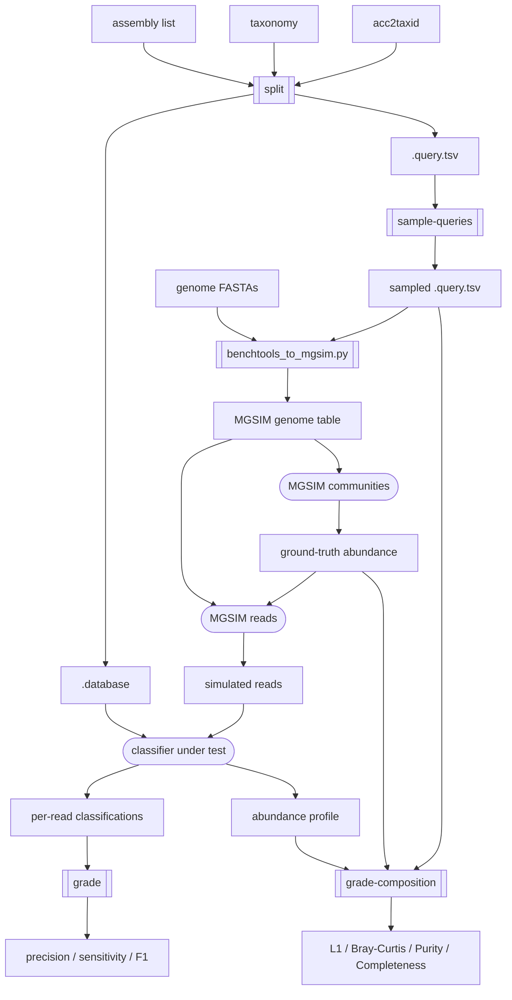

# metabuli-benchtools

Benchmarking and grading tools for metagenomic taxonomic classification and profiling.

It splits a set of assemblies into one reference set and six query sets — family/genus/species/subspecies **exclusion** tests and species/subspecies **inclusion** tests — so you can evaluate a classifier across different levels of database completeness and taxonomic resolution.

**Pipeline**

1. `split` — partition assemblies into a reference database and query sets.
2. `sample-queries` — draw a diversity-maximizing subset of the queries.
3. MGSIM — simulate reads from the query genomes.
4. `grade` / `grade-composition` — score per-read classification and profiling results.



<sub>Doubled-edge boxes are `benchtools` commands; stadium nodes are external tools (MGSIM and the classifier being benchmarked).</sub>

## Build

Requires a C++17 compiler and CMake ≥ 3.10. OpenMP is optional (multi-threads grading over multiple input files).

```sh
cmake -S . -B build -DCMAKE_BUILD_TYPE=Release
cmake --build build -j
```

The binary is produced at `build/benchtools`.

---

## Split assemblies into reference and query sets

`split` builds the reference database list and the six query sets in a single run.

### Input
- `<assembly list>` — one assembly accession (GCF_/GCA_) per line.
- `<taxonomy dir>` — directory with `names.dmp`, `nodes.dmp`, `merged.dmp`.
- `<assacc2taxid>` — assembly accession → taxid mapping, `accession<TAB>taxid` per line.

### Usage
```sh
benchtools split <assembly list> <taxonomy dir> <assacc2taxid> <output prefix> [--seed N] [--skip-validation]
```

### Output
- `<output prefix>.database` — accessions to build the reference database, one per line.
- `<output prefix>.query.tsv` — the query assemblies for all six categories, with grading metadata.
- `<output prefix>.summary` — assembly/taxa counts and a per-rank exclusion/inclusion breakdown.

#### `.query.tsv` columns

| Column | Meaning |
| --- | --- |
| `Accession` | the query assembly |
| `Category` | which test this query belongs to (see below) |
| `ExpectedRank` | deepest rank a correct call can reach given the database |
| `QueryTaxID` | taxid of the query assembly |
| `SubjectTaxID` | the taxon defining the case (excluded/shared); paired rows share it |
| `SubjectRank` | rank of `SubjectTaxID` |
| `SubjectSize` | number of direct members of `SubjectTaxID` |

**Exclusion** — `familyExclusion`, `genusExclusion`, `speciesExclusion`, `subspeciesExclusion`. The query's taxon at that rank is held out of the database while its parent remains, so a correct call reaches `ExpectedRank` = order / family / genus / species respectively. Every genome of the held-out taxon is listed.

**Inclusion** — `speciesInclusionPair`, `subspeciesInclusionPair`. A pair of database genomes sharing a genus / species (`SubjectTaxID`). The query's own species is in the database, so `ExpectedRank` = species; the shared taxon is a same-genus / same-species distractor. The two members of a pair share `SubjectTaxID`.

## Sample query sets

`sample-queries` draws a subset of `<query.tsv>`, maximizing the number of distinct taxa sampled within each category.

```sh
benchtools sample-queries <query.tsv> <output prefix> --number N [--ratio f,g,s,ss,si,ssi] [--seed N]
```

- `--number` — total number of queries to sample.
- `--ratio` — six weights for family/genus/species/subspecies exclusion and species/subspecies inclusion (default all `1`). Inclusion weights count pairs.

It writes `<output prefix>.query.tsv` (the sampled rows) and `<output prefix>.summary`.

## Simulate metagenomic reads with MGSIM

[MGSIM](https://github.com/nick-youngblut/MGSIM) simulates Illumina / PacBio / Nanopore reads with platform-specific error models (ART / SimLord / NanoSim-H). A pinned fork is bundled as the `third_party/MGSIM` submodule.

### Install MGSIM
```sh
scripts/install-mgsim.sh    # inits the submodule and builds the 'mgsim' conda env
conda activate mgsim
```

### Prepare the MGSIM genome table
`benchtools_to_mgsim.py` converts a query table into an MGSIM genome table, using each assembly accession as the `Taxon` label and resolving it to a FASTA under `<genome dir>`.

- `<query.tsv>` — the query table from `split` or `sample-queries`.
- `<genome dir>` — directory of genome FASTA files.

```sh
scripts/benchtools_to_mgsim.py <query.tsv> --has-header --genome-dir <genome dir> -o <genome table>
```

### Simulate communities and reads
```sh
# Abundance profiles (writes out/comm_abund.txt)
MGSIM communities --n-comm <N> <genome table> out/comm

# Reads (uses the genome table + the abundance table)
MGSIM reads <genome table> --sr-seq-depth <depth> out/comm_abund.txt out/illumina/   # Illumina
MGSIM reads <genome table> --pb-seq-depth <depth> out/comm_abund.txt out/pacbio/     # PacBio
MGSIM reads <genome table> --np-seq-depth <depth> out/comm_abund.txt out/nanopore/   # Nanopore
```

## Grade classification and profiling results

Two graders, both scoring per rank against the ground truth: `grade` evaluates
**per-read classification**, and `grade-composition` evaluates **abundance
(profiling)** estimates.

### grade — per-read classification

Scores each read's predicted taxon against an answer sheet, reporting precision /
sensitivity / F1 at each rank.

- `<classificationList>` — one classification-result path per line.
- `<mappingList>` — one `accession → taxid` answer-sheet path per line, aligned line-by-line with the classification list.
- `<taxonomy dir>` — `names.dmp`, `nodes.dmp`, `merged.dmp`.

```sh
benchtools grade <classificationList> <mappingList> <taxonomy dir> [options]
```

Key options: `--test-type` (`gtdb` [default], `cami`, `cami-long`, `cami-euk`,
`hiv`, …), `--rank`, `--read-id-col`, `--tax-id-col`, `--score-col`,
`--skip-secondary`, `--threads`.

### grade-composition — abundance / profiling

Compares each tool's estimated profile to the MGSIM ground-truth abundance, then
summarizes each tool across communities as the mean ± standard deviation of
**L1**, **Bray–Curtis**, **Purity** (precision), and **Completeness** (recall) at
each rank.

Scoring is *ExpectedRank-aware*: from each query genome's `ExpectedRank` in
`.query.tsv`, a held-out (exclusion) genome is scored only as deep as it is
reportable — credited at the genus/family/… where a perfect classifier places its
reads, never penalized for an unreachable species.

- `<profileList>` — 3-column TSV: `group` (tool) · `community` · report path. The `community` keys into the truth's `Community` column, so one run covers many tools × communities.
- `<truthAbundance>` — MGSIM `communities` output: `*_abund.txt` (cell fraction) or `*_wAbund.txt` (sequence fraction); use the one matching what the profiler reports.
- `<queryTsv>` — the `split` / `sample-queries` `.query.tsv` (supplies each genome's taxid and `ExpectedRank`).
- `<taxonomy dir>` — `names.dmp`, `nodes.dmp`, `merged.dmp`.

Each report is a Metabuli / Kraken-style table (`percentage, cladeReads,
taxonReads, rank, taxID, name`).

```sh
benchtools grade-composition <profileList> <truthAbundance> <queryTsv> <taxonomy dir> [--rank species,genus] [--min-abundance F]
```

Output — one row per `(group, rank)`:

```
Group  Rank  N  L1_mean L1_sd  BrayCurtis_mean BrayCurtis_sd  Purity_mean Purity_sd  Completeness_mean Completeness_sd
```

`--min-abundance` is the estimated fraction above which a taxon counts as detected
(for purity / completeness).
